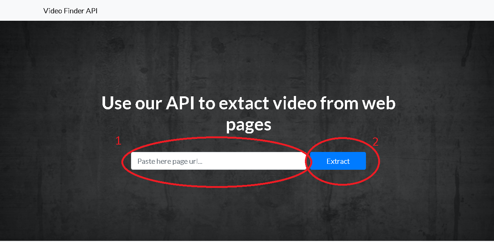

# Video-Finder-API
**Open-source API** to find main video in given web page

# Description
**Video-Finder** offers the opportunity to extract the direct link and many other attributes of a video from a web page. 
It is based on the Node **Puppeteer** library for Headless Chrome, thanks to the potential of this tool, Video-Finder-API performs a completely automated data extraction on the page.

# Installation
Assuming you have node and npm properly installed on the machine, you have to:

- Download the code.
- Navigate to inside the project folder on terminal, where you would hopefully see a package.json file.
- Do an `npm install` for installing all the project dependencies
- Then `npm start` to get the app running on local host

# Usage
The usage of Video-Finder is pretty simple, just copy and paste your web page **URL** on the serch bar first, then submit the output request by clicking the "Extract" button, the response will be given after some seconds.

Output example:

